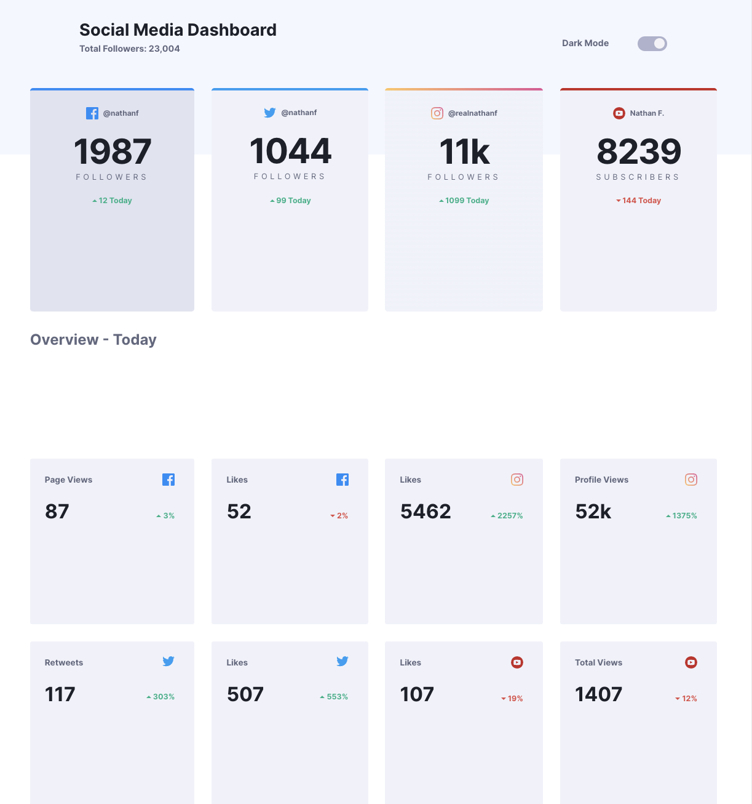

# Frontend Mentor - Social media dashboard with theme switcher solution

This is a solution to the [Social media dashboard with theme switcher challenge on Frontend Mentor](https://www.frontendmentor.io/challenges/social-media-dashboard-with-theme-switcher-6oY8ozp_H). Frontend Mentor challenges help you improve your coding skills by building realistic projects.

## Table of contents

- [Overview](#overview)
  - [The challenge](#the-challenge)
  - [Screenshot](#screenshot)
  - [Links](#links)
- [My process](#my-process)

  - [Built with](#built-with)

  - [Continued development](#continued-development)
  - [Useful resources](#useful-resources)

- [Author](#author)

## Overview

### The challenge

Users should be able to:

- View the optimal layout for the site depending on their device's screen size
- See hover states for all interactive elements on the page
- Toggle color theme to their preference

### Screenshot

### Links

- Solution URL: [Github repo](https://github.com/mrcordova/social-media-dashboard-with-theme-switcher)
- Live Site URL: [Github page](https://mrcordova.github.io/social-media-dashboard-with-theme-switcher/)

## My process

### Built with

- Semantic HTML5 markup
- CSS custom properties
- Flexbox
- CSS Grid

### Continued development

Learn more about CSS grid, I was able use autofit and then media query to set the final grid layout and how to give one element entire row.

### Useful resources

- [gradient border](https://codepen.io/AlexOverbeck/pen/axGQyv?editors=1100) - How to give the appearance of a border with a gradient border
- [how to use custom css properties for dark theme](https://css-tricks.com/a-complete-guide-to-dark-mode-on-the-web/#aa-using-custom-properties) - This helped understand how to work with different themes.
- [How to make a css toggle switch](https://www.w3schools.com/howto/howto_css_switch.asp) - How to make a toggle switch with a label.

## Author

- Website - [Github repo](https://github.com/mrcordova)
- Frontend Mentor - [@mrcordova](https://www.frontendmentor.io/profile/mrcordova)
